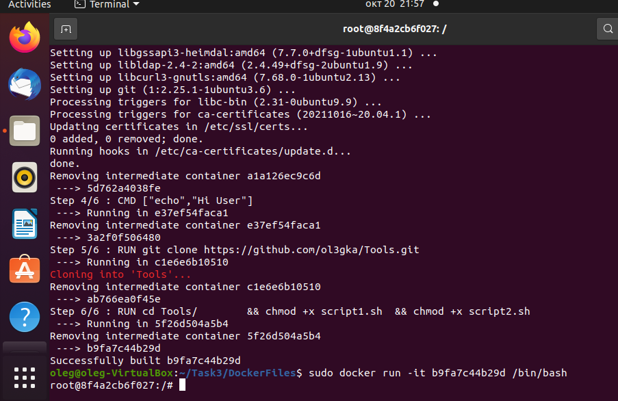
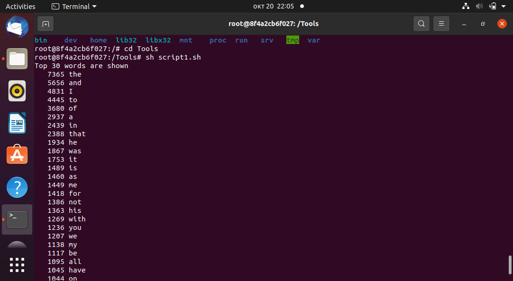
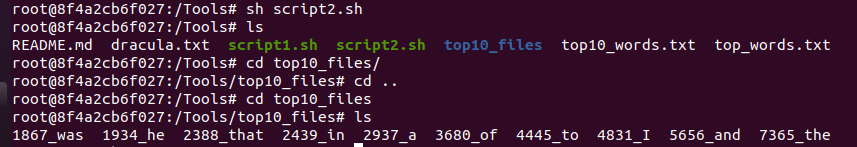

# Repo for Tasks 2 and 3
Solution for Tasks 2 and 3 of contest for ML engeneer position at Skoltech Applied AI Center by Nikolaev O.V.

In root folder description of the tasks is presented 

```
Задание на позицию инженер исследователь.docx
```
# Task 2
This task is partially completed (first part), no solution coded for question about optimum number of people for party, but here is some intuition:

Intuition is in that approach that we have to invite friends with less connections with other people firstly (degree of a vertex is --> min), and than only invite people with bigger and bigger degree of a the vertex. So, degree of each vertex should be precomputed. Such approach allows to invite most people, which are not familar with each other.
(degree of a vertex - number of edges on the node)

In the folder "Task 2" tree files are presented:
1) *module.py* - module within classes with methods (simple graph, as well as random graph creation);
2) *task2_solution* - Jupiter notebook with description of solution (*module.py* duplicated inside);
3) Html version of *task2_solution* to preserve all pictures.


# Task 3
To deal with 3d task (aka Linux), plz download dockerfile ("Dockerfile" from folder Task3) or clone it by git clone.

To build dockerfile, run such command in terminal in folder with Dockerfile:
```
sudo docker build --no-cache .
```
Run dockerfile in interactive mode by (NOTE! that docker container ID b9fa7c44b29d will be different in your case):
```
sudo docker run -it b9fa7c44b29d /bin/bash
```
If everything will be correct you will see, that your are inside of container:

<!-- #region -->
<p align="center">

</p>

```
cd Tools
```

To obtain results of subtask 1, run command below. It will create file top_words.txt with all words counted and also it will show on display top 30 words (with their count) from file dracula.txt
```
sh script1.sh
```


<!-- #region -->
<p align="center">

</p>

To obtain results of subtask 2, run command below. It will create folder top10_files in which files with name and count frequency are presented, as it required in the task.
```
sh script2.sh
cd top10_files
ls
```
<!-- #region -->
<p align="center">

</p>
To exis docker container run:

```
Ctrl+d
```

To shut down container run:

```
sudo docker rm 8f4a2cb6f027
```

And to check active containers/images you can run - list should be empty at the end of the work

```
sudo docker container ls --all
```
